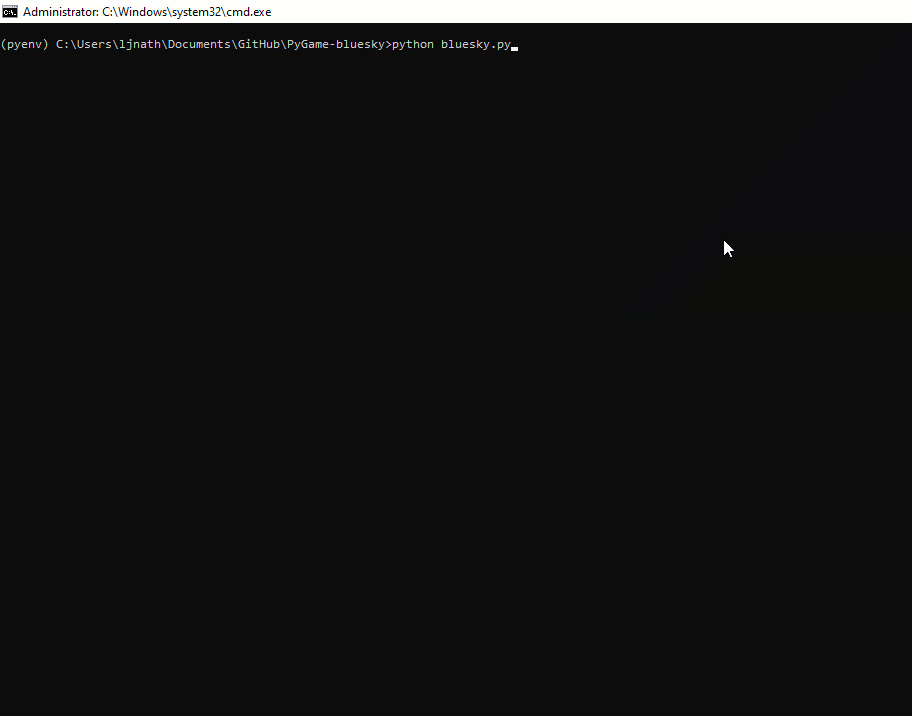

# PyGame-bluesky
 An enhance version of https://realpython.com/blog/python/pygame-a-primer

# Bluesky
### Version : 0.3

Author : Lakhya Jyoti Nath (ljnath) 
Date : April 2020 
Email : ljnath@ljnath.com 
Website : https://www.ljnath.com

### [0.3] - 2020-04-25
- added replay mechanism, where user can select their replay choice

### [0.2] - 2020-04-24
- refactored code and added comments
- changed jet image and collision sound
- changed cloud image and added support for random cloud design

### [0.1] - 2020-04-23
- first version with default game play
- added gameover message during collision
- added game scoring and playtime

## Demo

