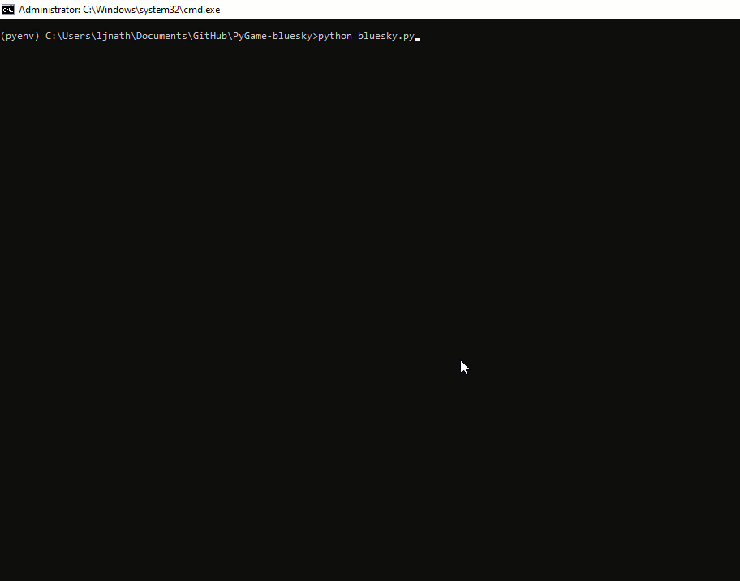

# PyGame-bluesky
### Version : 0.9

A simple python game protect your jet from missiles attack based on pygame framework  
Based on https://realpython.com/blog/python/pygame-a-primer

Author : Lakhya Jyoti Nath (ljnath) 
Date : April 2020 
Email : ljnath@ljnath.com 
Website : https://www.ljnath.com

## Change Log
### [0.9] - 2020-05-01
- added shoot functionality for the jet by clicking mouse of pressing spacebar
- updated score calculation, now destroying 1 missile gives 10 pts
- added game instruction in welcome screen
- added sound effects for shooting and destroying missiles

### [0.8] - 2020-04-27
- added methods to continously move text on either X or Y axis
- added author sprite in the game menu

### [0.7] - 2020-04-26
- added game title in the menu
- added support for level up in the game, missile count will increase every level
- added sound for level up
- removed redundant condition check in jet sprite
- renamed GameInputText to GameMenuText

### [0.6] - 2020-04-26
- refactored game code into modules based on sprite
- introduced game environment to maintain and share game environment data across different various modules

### [0.5] - 2020-04-26
- added support for continous jet movement towards cursor; even on fixed mouse position

### [0.4] - 2020-04-26
- added suport for mouse movement as game input
- added input mode screen on game start
- fixed replay text sprite rendering

### [0.3] - 2020-04-25
- added support for game replay

### [0.2] - 2020-04-24
- refactored code and added comments
- changed jet image and collision sound
- changed cloud image and added support for random cloud design

### [0.1] - 2020-04-23
- first version with default game play
- added gameover message during collision
- added game scoring and playtime

## Demo

